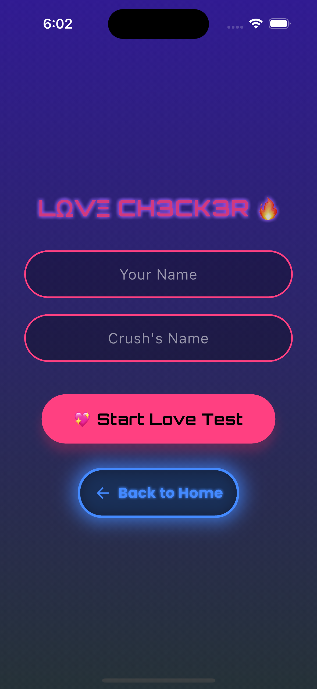

# 🎮 Fun Master - Flutter Quiz App 🚀

**Fun Master** is an engaging quiz app built with Flutter. Challenge yourself with fun quizzes and earn points! 🎯

## 📸 Screenshots

 

## 🔥 Features

- 🏆 Fun & interactive quizzes
- 🎨 Beautiful UI with smooth animations
- 📊 Score tracking and rewards
- 🔥 Built with **Flutter & Firebase**

## 🚀 Installation

1. Clone this repository:
   git clone https://github.com/osama-yaseen/FunMaster.git

markdown
Copy
Edit 2. Open the project in **VS Code or Android Studio**. 3. Run:
flutter pub get flutter run

markdown
Copy
Edit

## 📌 Tech Stack

- **Flutter**
- **Firebase Authentication**
- **Firestore Database**
- **GetX for State Management**
- **Lottie for Animations**

## 📬 Contact

For any queries, reach out:
📧 Email: osama.shehdeh.yaseen@gmail.com
